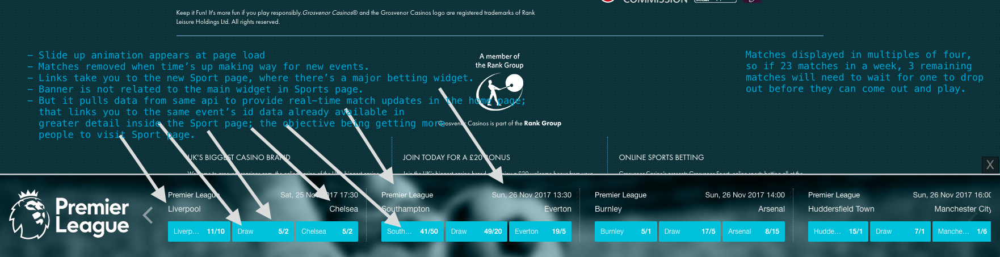

# premier league banner &nbsp; :soccer:
- 1 mainHtmlExec.js
- 2 serverCall.js

### reference files
- footballbanner.html is the banner
- ison.html is the file i tested to pull data from Api
- kambistat.css part of the kambi.css
- kambistat.js part of the kambi.js

### experiment  &nbsp; :monkey:
- adds a fixed footbanner to the home page, with a slider that holds    
  all of the upcoming week's matches, odds stas etc - all dynamically retrieved from Kambi Api.    
- Games are then removed when event starts and new ones added every week or as soon as they're made available
  by the Api.    
- Cta links take to the Sport page where the main widget holds additional information, odds, bets about the games.

  

<kbd>:soccer: banner &nbsp; :zap:</kbd>

=====================================================

